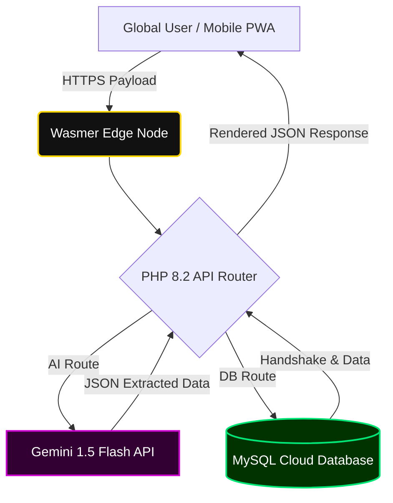
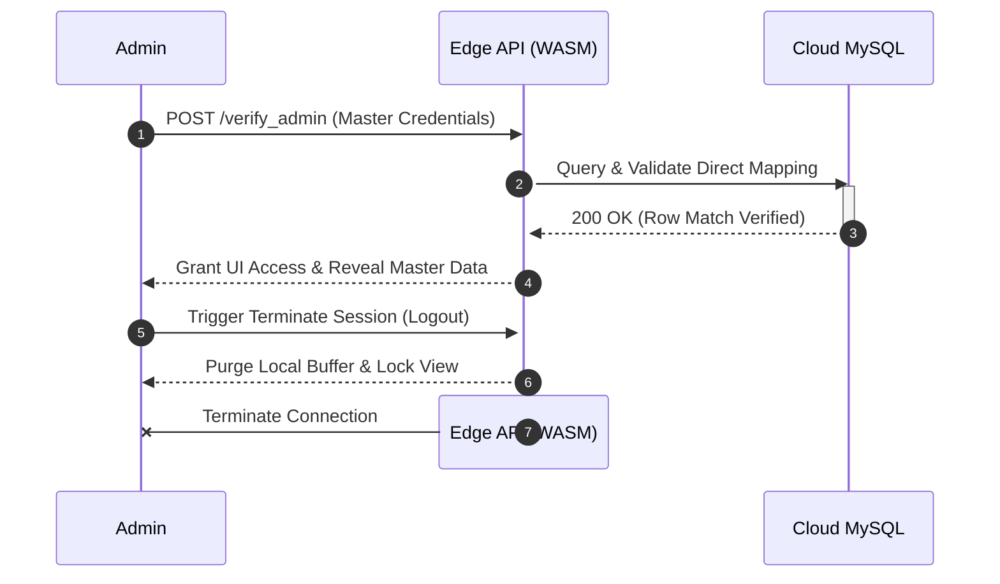

# ANY GPA | AI-Powered Global SaaS Engine 🌐🧠

**ANY GPA** is a high-performance, AI-driven, and globally crowdsourced academic calculation engine. Built for absolute flexibility, it allows students from any university worldwide to input, save, and share their specific grading frameworks, while utilizing state-of-the-art visual AI to automate data entry from official transcripts.

This module serves as the academic calculation branch of the broader **Integrated Production and Resource Management System** portfolio.

---

## ✨ Enterprise Features

* **AI Vision Extractor (Gemini 1.5 Flash):** Features an advanced Optical Character Recognition (OCR) and semantic extraction engine. Users can upload PDF or Image transcripts, and the AI automatically maps course titles and grades into the UI. Includes a robust 5-key automated failover rotation to guarantee zero-downtime processing.
* **Edge Routing & Computation:** Deployed on Wasmer Edge containers using WebAssembly (WASI) runners for ultra-low latency PHP execution and secure outbound AI API communication.
* **Global Strategy Builder & Dynamic Thresholds:** Users can design custom grading scales, define mandatory pass marks, deploy them to the global cloud database, or run them locally for temporary session memory.
* **Progressive Web App (PWA) Architecture:** Fully responsive, touch-optimized mobile UI with a custom HUD dropdown menu, GPU-accelerated GSAP 3D tilt physics, and interactive data visualization.
* **Native PDF Engine:** Client-side generation of highly accurate, printable, and mathematically verified official academic transcripts using `jsPDF` and `AutoTable`.
* **"God Mode" Administration:** Secure, keylogger-activated terminal for live database management and system purging.

---

## 🏗️ System Architecture

The system utilizes a stateless Edge computing model. The PHP backend connects via a persistent PDO buffer to a remote managed MySQL instance, while securely tunneling external HTTP requests to Google's Generative AI models.

## 🗄️ Database Mapping & Architecture

The backend infrastructure relies on a high-throughput MySQL Cloud Database. To ensure seamless, low-latency connectivity from the Wasmer Edge WebAssembly environment, all database user protocols are explicitly configured to utilize `mysql_native_password` authentication, bypassing standard edge-encryption bottlenecks.

> **⚠️ ACADEMIC EVALUATOR NOTICE (READ FIRST)**
> For this specific coursework iteration and module project evaluation, **user authentication passwords are intentionally stored in plain text**. 
> 
> **Architectural Justification:** This configuration demonstrates a direct database insertion mapping to the evaluation panel. It provides a transparent, verifiable 1:1 data bridge (e.g., UI Input `111111` -> Database Row `111111`) to prove the core structural integrity of the application. Cryptographic hashing (such as `bcrypt` or `Argon2`) will be implemented in the final commercial release pipeline.

### Core Relational Tables
The system utilizes a Third Normal Form (3NF) compliant database structure to eliminate redundancy:
* `grading_systems`: The primary entity table storing global university identities, localized country data, dynamic `pass_mark` thresholds, and public visibility states.
* `grade_rules`: A dependent relational table mapping specific letter grades (e.g., A+) to their numerical point equivalents. This is tightly bound to `grading_systems` via a cascading `system_id` foreign key.
* `direct_messages`: A standalone, secure ledger capturing encrypted payload submissions from the Developer Communicator API.

---

## 🚀 Deployment & Installation Guide

ANY GPA is engineered with a hybrid, environment-agnostic deployment pipeline. Follow these instructions to initialize the environment locally or deploy to the global edge network.

### Phase 1: Local Development (XAMPP/WAMP)
*Ideal for testing UI/UX modifications and database schema iterations.*

1. **Clone the Repository:** Extract the project files into your local `htdocs` or `www` directory.
2. **Initialize Services:** Launch the Apache Server and MySQL Database via your local control panel.
3. **Database Migration:** Navigate to `http://localhost/phpmyadmin`. Create a new database named `any_gpa_core` and import the provided `.sql` schema file.
4. **Configure Credentials:** Open `db.php` and `config.php` to set your local MySQL variables and securely inject your Google Gemini API keys.

### Phase 2: Edge Production Deployment (Wasmer)
*The system deploys globally to the Wasmer Edge network. It requires a strictly configured `wasmer.toml` file mapping outbound MySQL traffic and explicitly granting the `http_client` capability for secure AI communication.*

1. **Install the CLI:** Ensure the Wasmer Command Line Interface is installed on your machine.
2. **Authenticate Environment:** Execute `wasmer login` in your terminal to sync your deployment token.
3. **Set Cloud Credentials:** Update `db.php` to target your live cloud MySQL instance (e.g., Supabase, FreeDB).
4. **Execute Deployment:** Run `wasmer deploy`.
5. **System Verification:** The Wasmer runtime will map the file system, compile the WebAssembly PHP engine on `0.0.0.0:8080`, and provision your live production URL.

---

## 🔒 Security & Authentication Lifecycle

To prevent unauthorized modification of crowdsourced grading scales, the system features a hidden, keylogger-activated administration terminal. Because the Edge architecture is inherently stateless, the authentication handshake follows a strict, single-session validation path.

## 👨‍💻 System Architecture & Lead Engineering

**ANY GPA** was independently designed, developed, and deployed as a flagship application within a comprehensive software engineering portfolio. It demonstrates advanced proficiency in full-stack web development, Edge-native deployments, asynchronous API integration, and AI-driven data automation.

This system serves as a practical application of enterprise-level architectural concepts, specifically targeting complex state management, secure cloud database integration, and responsive, cross-device layout engineering.

### Developer Profile
* **Lead Engineer & UI/UX Architect:** Nimna (Sandanimne)
* **Open Source Contributions:** [GitHub /NimnaOfficial](https://github.com/NimnaOfficial)
* **Professional Network:** [LinkedIn /in/Sandanimne](https://www.linkedin.com/in/sandanimne-k-g-l-a276aa34a)

 

> *"Engineering intuitive, high-performance, and globally accessible tools for the future of academic management."*
