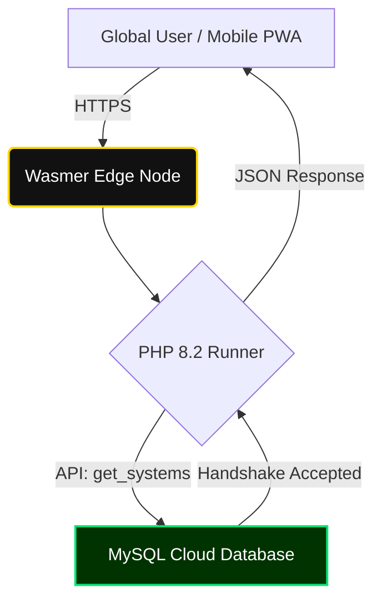
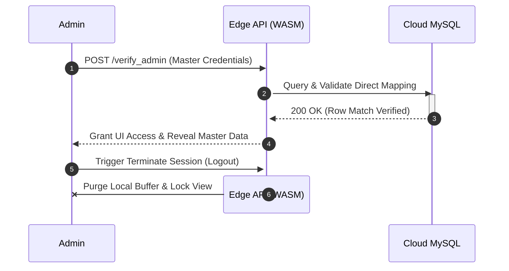

# ANY GPA | Global SaaS Engine 🌐🎓


**ANY GPA** is a high-performance, globally crowdsourced academic calculation engine. Built for absolute flexibility, it allows students from any university worldwide to input, save, and share their specific grading frameworks and calculation strategies. 

This module serves as the academic calculation branch of the broader **Integrated Production and Resource Management System** portfolio.

---

## ✨ System Features

* **Progressive Web App (PWA) Architecture:** Fully responsive, touch-optimized mobile UI with a custom HUD dropdown menu and GPU-accelerated GSAP physics (automatically disabled on mobile to preserve battery).
* **Edge Routing & Computation:** Deployed on Wasmer Edge containers using WebAssembly (WASI) runners for ultra-low latency PHP execution.
* **Global Strategy Builder:** Users can design custom grading scales, deploy them to the global cloud database, or run them locally for temporary session memory.
* **Institutional Gateways:** Built-in programmatic checks for specific university frameworks (e.g., NIBM HNDSE26.1F criteria, Comm-2 module validation).
* **Native PDF Engine:** Client-side generation of highly accurate, printable, and mathematically verified official academic transcripts using `jsPDF` and `AutoTable`.
* **"God Mode" Administration:** Secure terminal for database management and live system purging.

---

## 🏗️ System Architecture

The system utilizes a stateless Edge computing model. The PHP backend connects via a persistent PDO buffer to a remote managed MySQL instance.


## 🗄️ Database Mapping & Architecture

The backend infrastructure relies on a highly optimized MySQL Cloud Database. To ensure seamless connectivity from the Wasmer Edge WebAssembly environment, all database user protocols are explicitly configured to use `mysql_native_password` authentication. This bypasses modern Edge encryption limitations and guarantees maximum data throughput.

> **⚠️ ACADEMIC EVALUATOR NOTICE (READ FIRST)**
> For this specific coursework iteration and DSE 25.1 project evaluation, **user authentication passwords are intentionally stored in plain text**. 
> 
> **Architectural Justification:** This is explicitly configured to demonstrate direct database insertion mapping to the evaluation panel. It provides a transparent, verifiable 1:1 data bridge (e.g., UI Input `111111` -> Database Row `111111`) to prove the core structural integrity of the application before cryptographic hashing (such as bcrypt) is implemented in the final commercial release.

### Core Relational Tables
The system utilizes a strictly normalized database structure to eliminate data redundancy:
* `grading_systems`: The primary parent table storing global university identities, localized country data, and public/private visibility states.
* `grade_rules`: A dependent relational table mapping specific letter grades (e.g., A+) to their numerical point equivalents. This is tightly bound to `grading_systems` via a cascading `system_id` foreign key.
* `direct_messages`: A standalone, secure ledger capturing encrypted payload submissions from the Developer Communicator form.

---

## 🚀 Deployment & Installation Guide

ANY GPA is engineered with a hybrid deployment pipeline. Follow these instructions to initialize the environment either locally or on the global edge network.

### Phase 1: Local Development (XAMPP/WAMP)
Ideal for local testing, UI/UX modifications, and database schema adjustments.

1.  **Clone the Repository:** Extract the project files into your local `htdocs` (XAMPP) or `www` (WAMP) directory.
2.  **Initialize Services:** Launch the Apache Server and MySQL Database via your local control panel.
3.  **Database Migration:** Navigate to `http://localhost/phpmyadmin`. Create a new database named `any_gpa_core`. Import the provided `any_gpa_core.sql` file to automatically build the tables and structure.
4.  **Configure the Bridge:** Open `db.php` and verify the local development credentials:
    ```php
    $host = "localhost";
    $user = "root";
    $password = ""; // Leave blank for default XAMPP configurations
    $database = "any_gpa_core";
    ```

### Phase 2: Edge Production Deployment (Wasmer)
The system is built to deploy globally to the Wasmer Edge network. It uses a strictly configured `wasmer.toml` file to map outbound MySQL traffic over secure ports (e.g., port 10272).

1.  **Install the CLI:** Ensure the Wasmer Command Line Interface is installed on your machine.
2.  **Authenticate Environment:** Open PowerShell or Terminal and execute `wasmer login` to synchronize your deployment token.
3.  **Set Cloud Credentials:** Update your `db.php` file to point to your live cloud MySQL instance.
4.  **Execute Deployment:** Run the final build command to compile and push the environment:
    ```bash
    wasmer deploy
    ```
5.  **System Verification:** The Wasmer runtime will successfully map the `http` capability, spin up the WebAssembly PHP engine on `0.0.0.0:8080`, and generate your live production URL.

---

## 🔒 Security & Authentication Lifecycle

To prevent unauthorized modification of the crowdsourced grading scales, the system features a hidden "God Mode" administration terminal. Because the Edge architecture is inherently stateless, the authentication handshake follows a strict, single-session validation path.


## 👨‍💻 System Architecture & Lead Engineering

**ANY GPA** was independently designed, developed, and deployed as a flagship application within a comprehensive software engineering portfolio. It demonstrates advanced proficiency in full-stack web development, edge-native deployment architectures, and modern UI/UX principles (including GSAP physics and PWA-standard mobile responsiveness).

This system serves as a practical application of enterprise-level concepts mastered during the Higher National Diploma program, specifically targeting complex state management, secure cloud database integration, and responsive cross-device layout engineering.

### Developer Profile
* **Lead Engineer & UI/UX Architect:** Sandanimne
* **Open Source Contributions:** [GitHub /NimnaOfficial](https://github.com/NimnaOfficial)
* **Professional Network:** [LinkedIn /in/Sandanimne](https://www.linkedin.com/in/sandanimne-k-g-l-a276aa34a)

<br>

> *"Engineering intuitive, high-performance, and globally accessible tools for the future of academic management."*
